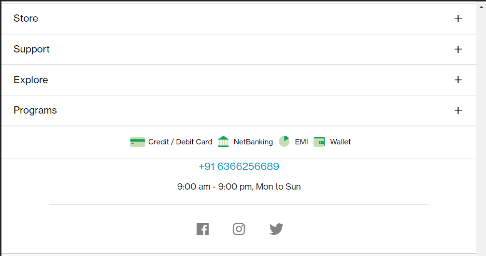
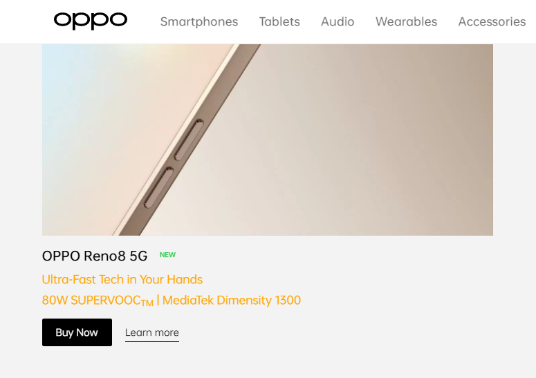

# 1.  Webiste Name: [Dev To](https://dev.to/)

 ### Sample Image

## Code:-
    document.querySelector(".side-bar .crayons-card .crayons-subtitle-2").innerHTML = "Amarjeet kumar"

    document.querySelector(".side-bar .crayons-card .color-base-70 ").textContent = "I am a Full Stack Web Developer"

### My Output Image

# 2. Website Name: [Apple](https://support.apple.com/en-in)

### Task
    Fetch all the product name and store in an array

 code:- 

    let arr = [];
    arr.push(document.querySelectorAll(".as-imagegrid-item ")[0].getElementsByTagName("span")[0].innerText)

    arr.push(document.querySelectorAll(".as-imagegrid-item ")[1].getElementsByTagName("span")[0].innerText)

    arr.push(document.querySelectorAll(".as-imagegrid-item ")[2].getElementsByTagName("span")[0].innerText)

    arr.push(document.querySelectorAll(".as-imagegrid-item ")[3].getElementsByTagName("span")[0].innerText)

    arr.push(document.querySelectorAll(".as-imagegrid-item ")[4].getElementsByTagName("span")[0].innerText)

    arr.push(document.querySelectorAll(".as-imagegrid-item ")[5].getElementsByTagName("span")[0].innerText)

    arr.push(document.querySelectorAll(".as-imagegrid-item ")[6].getElementsByTagName("span")[0].innerText)

### output:-
    arr(7) = ['iPhone\nSupport', 'Mac\nSupport', 'iPad\nSupport', 'Watch\nSupport', 'AirPods\nSupport', 'Music\nSupport', 'TV\nSupport']

## 3. Webiste Name: [Youtube Support](https://support.google.com/youtube/)

### Topics
    - Get Element By Id, Create Element, Create Text Node, Append Child
 

### Sapmle image

let h3 = document.createElement("h3")

h3.role = "button"

h3.tabIndex = "0"

h3.ariaExpanded="false"

h3.ariaLabel = "My New FAQ"

h3.textContent = "My New FAQ"

let span = document.createElement("section")

span.className = "parent"

span.appendChild(h3)

document.querySelector(".accordion-homepage").appendChild(span)

# question-4  One Plus

### Sample Image
Webiste Name: [OnePlus](https://www.oneplus.in/support)

document.getElementsByClassName("one-tel-number")[0].innerText = "+91 6366256689"

# 5.  Samsung Phone
   Webiste Name: [Samsung](https://www.samsung.com/in/offer/online/samsung-fest/)

### Sample Image

### My output Output

# 6. Input Backgroung

 Webiste Name: [Adidas](https://www.adidas.co.in/)

### Topics

    -   Query Selector, Event listeners, Changing Styles

### Sample Image

### sample Output

### Tasks
     Target the search box and on hover change thebackground color to red.

document.querySelector(".searchinput-wrapper___3YrvF form input").addEventListener("click" , ()=>{ document.querySelector(".searchinput-wrapper___3YrvF form input").style.backgroundColor = "Red"  })

### My output 

# 7. MDN Docs
Webiste Name: [MDN Web Docs](https://developer.mozilla.org/en-US/)

### Topics

       Form, Value, Submit

### Sample Image

document.getElementById("top-nav-search-input").value = "CSS"

<!-- ### Tasks

     To Search a topic in the MDN Search bar.
     First add a text to search in the search bar and then hit the submit search button to search the docs using DOM -->

### my output 

#  8. Webiste Name: [Google](https://www.google.com/)

### Topics

       Remove Elements

### Sample Image

<!-- ### Tasks

     Remove alternate languages from the home page languages listed -->

let arr = document.querySelectorAll("#SIvCob a")

### Output

# 9. Webiste Name: [Code Wars](https://www.codewars.com/)

### Topics

       Change Font Family, Color of Text.

### Sample Image

### Sapmle Output

### Tasks

    Change the font family of the text to monospace and text color to the logo’s background color.
### Code:
     let button = document.querySelector(".button-large")

     let button_bg_color = window.getComputedStyle("button").backgroundColor

    let text = document.querySelector(".display-heading-1")

    text.style.color = button_bg_color
    text.style.fontFamily = "monospace"

### MY Output Image

# 10. Webiste Name: [Freecodecamp](https://www.freecodecamp.org/)

### Topics

       querySelector, mouseover, click eventListener,  callback function, style,

### Sample Image

### Sample Output

### Tasks

    Target the button and change background colour on mouseover

### Code:-
     
    
     let span = document.querySelectorAll("span") 

     span[15].style.backgroundColor = "red"  

     span[15].addEventListener('mouseenter', () => {span[15].style.backgroundColor = "red"}); 

     span[15].addEventListener('mouseleave', () => {span[15].style.backgroundColor = "transparent"});

### My  Output image:-

# question:- 11. Webiste Name: [realme](https://www.realme.com/in/)

### Topics

       querySelector,style,background-image

### Sample Image

### Sample Output

### Tasks
    change the realme logo to ineuron logo

### CODE:-

    document.querySelector(".wrapper a")

    document.querySelector(".wrapper a").innerHTML =  `  `

    document.querySelector(".wrapper a img").src = 'https://ineuron.ai/images/ineuron-logo.png'

    document.querySelector(".wrapper a img").style.width = "130px"

### My  Output image:-

12. Webiste Name: [Github](https://github.com/)

### Topics

       querySelector,style,background-Color

### Sample Image

### Sample Output

### Tasks
     change the background colour of the button to blue.

### CODE:-
     let btn =  document.querySelectorAll(".btn-primary")

     btn[1].style.backgroundColor =  "#233c86"
  

### My  Output image:-

# Questiov:- 13.
# Webiste Name: [Hackerrank](https://www.hackerrank.com/)

### Topics
    querySelector,innerHtml

### Sample Image

### Sample Output

### Tasks

Target the top description and change “Matching developers with great companies” to ‘JSBOOTCAMP“.

### Code:-
    let text = document.querySelector("h1 span")
    text.innerText = "JSBOOTCAMP"

### Output

# 14. Webiste Name: [Asus](https://www.asus.com/in/)

### Topics
    querySelector,style,font-size

### Sample Image

### Sample Output

### Tasks
    change the fontsize of “Hot Deals” to 80px

### Code:-
    let text = document.querySelector(".HotDealsAll__Heading__2fIbe")

    text.style.fontSize = "80px"

### My output Picture:-

# 15.  Webiste Name: [Dell](https://www.dell.com/en-in/shop/deals/laptop-deals?gacd=10415953-9016-5761040-285981356-0&dgc=ST&gclid=Cj0KCQjwguGYBhDRARIsAHgRm4-XUDMhhVNyHXb3s1gY4ZBzORr_d9Se-buhJwy7asyUe7YdqEA11eEaAt6UEALw_wcB&gclsrc=aw.ds&nclid=BxjBlpBQsX6pjSHh-L8YYSU77EpfXRkG1AGMB5Wbeu386ykspfrPDnfx_DdFau20)

### Topics

      querySelector,style.textAlign

### Sample Image

### Sample Output

### Tasks

       Convert the text “G15 Gaming Laptop” from left to right

### Code:-
    let text = document.querySelectorAll(".ps-title")

    text[4].style.textAlign = "right"

### My output Picture:-

# 16. Webiste Name: [Vercel](https://vercel.com/)

### Topics
     querySelector,innerHTMl

### Sample Image

### Sample Output

### Tasks

      change the heading “Start with the developer” to “Start with Scratch”

### Code:-

    let text = document.querySelector(".section-title_title__VEDfK")

    text.innerHTML = "Start with Scratch"

### My output Picture:-

# 17. Webiste Name: [Sony](https://www.sony.co.in/)

### Topics
    querySelector,innerHTMl

### Sample Image

### Sample Output

### Tasks
     change the button text To current Date.

### Code:-
    let today = new Date();

    document.querySelector(".btn-container").innerText  = today

### My output Picture:-

# 18. Webiste Name: [Philips](https://www.philips.co.in/)

### Topics
     querySelector,style,backgroundcolor

### Sample Image

### Sample Output

### Tasks

    change the background colour blue to orange

### Code:-
    document.querySelector(".p-f03-footer-container ").style.background = "orange"    

### My output Picture:-

# 19. Webiste Name: [Canon](https://in.canon/)

### Topics
          querySelector,src

### Sample Image

### Tasks
    extract the canon logo

### My output Picture:-

# 20. Webiste Name: [Oppo](https://www.oppo.com/in/)

### Topics
          querySelector,style,color

### Sample Image

### Sample Output

### Tasks
    Change the description colour black to orange

### Code:-      
    let txt = document.querySelectorAll(".desc")[0]

    txt.style.color = "orange"

### Output

### My output Picture:-
